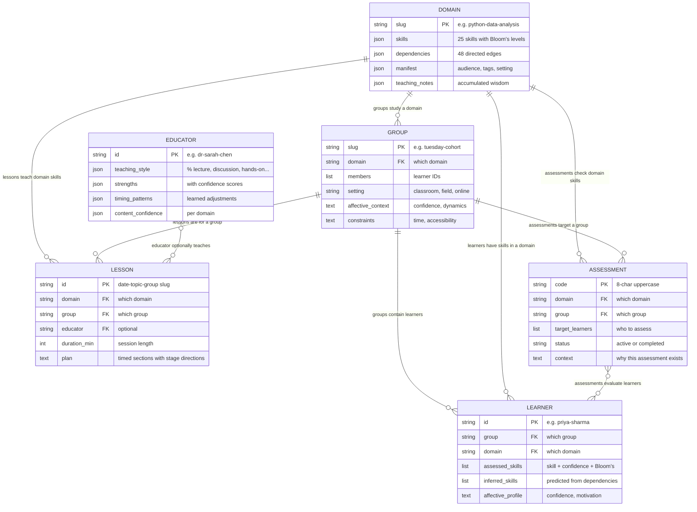
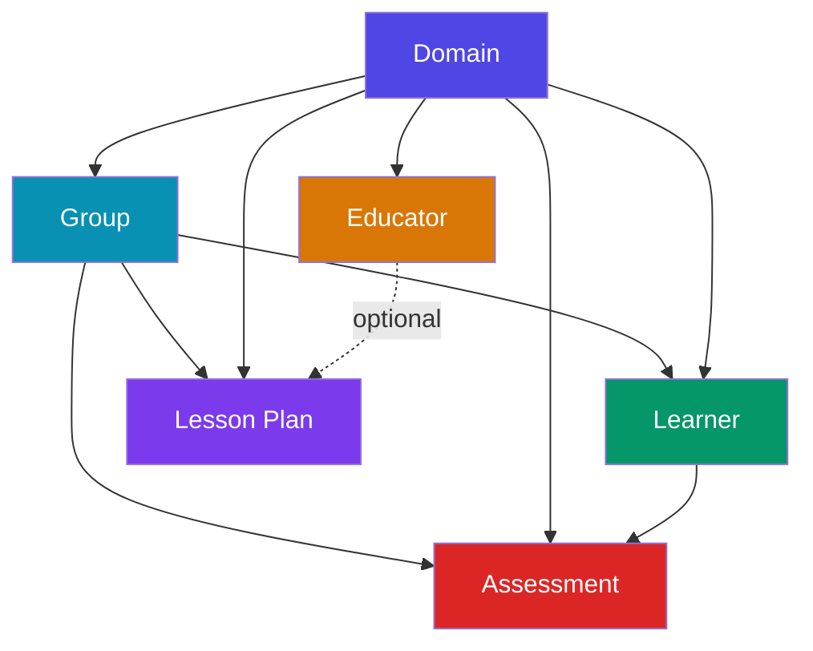

# Entities and Relationships

The engine has 6 core entities. Everything else (assessments, debriefs, reasoning traces, teaching notes) are **events** that flow between them.

## The 6 entities

| Entity | What it is | File location |
|--------|-----------|---------------|
| **Domain** | A subject area defined as a skill graph (DAG of skills with Bloom's levels and dependencies) | `data/domains/{slug}/` |
| **Group** | A cohort of learners studying a domain together, with interview context (setting, constraints, affective notes) | `data/groups/{slug}.md` |
| **Learner** | An individual with assessed and inferred skill levels, belonging to a group | `data/learners/{id}.md` |
| **Educator** | A teaching profile — style preferences, strengths, timing patterns, content confidence | `data/educators/{id}.json` |
| **Lesson** | A timed, stage-directed plan for a specific group in a specific domain | `data/lessons/{id}.md` |
| **Assessment** | A session where a learner's skills are evaluated through conversation | `data/assessments/{code}.md` |

## How they connect

## What depends on what

Nothing exists in a vacuum. Here's the creation dependency order:

**Domain** is the root — everything flows from having a skill graph. **Educator** is the one independent entity; it can exist before any domain does, but it only becomes useful when connected to a lesson.

## Multiplicity rules

- A domain can have **many groups** studying it (Tuesday cohort and Thursday cohort both learning Python)
- A group belongs to **one domain** (the Tuesday cohort studies python-data-analysis)
- A group has **many learners**; a learner belongs to **one group** (at the profile level)
- A domain can have **many lessons** (different topics, different days, different groups)
- A group can have **many lessons** over time (Week 1, Week 2, Week 3...)
- An educator can teach **many lessons** across different domains and groups
- A lesson has **one domain**, **one group**, and **optionally one educator**
- An assessment targets **one domain** and **one group**, but can assess **many learners**

## ID conventions

| Entity | Format | Example |
|--------|--------|---------|
| Domain | `kebab-case` | `python-data-analysis` |
| Group | `kebab-case` | `tuesday-cohort` |
| Learner | `kebab-case` | `priya-sharma` |
| Educator | `kebab-case` | `dr-sarah-chen` |
| Lesson | `date-topic-group` | `2026-02-12-pandas-groupby-tuesday-cohort` |
| Assessment | `8-char uppercase` | `TUE-2026-0211` |
