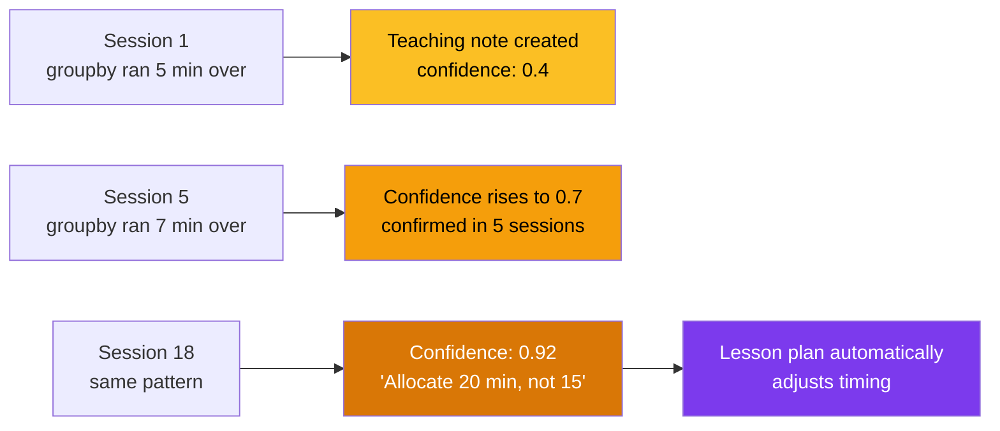
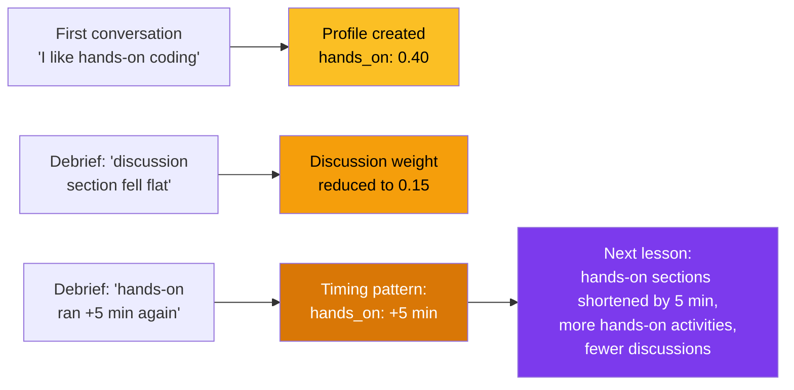
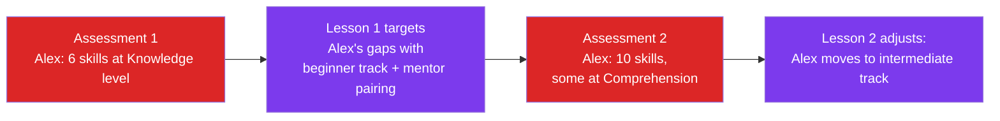
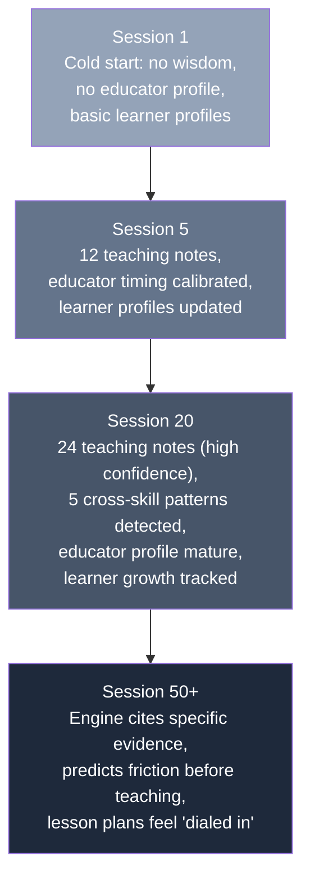

# Feedback Loops: How the engine gets smarter

The engine doesn't just plan lessons — it learns from every session. Three feedback loops compound over time.

## The three loops

```mermaid
graph TD
    subgraph "Loop 1: Teaching Wisdom"
        L1[Teach a lesson] --> D1[Debrief]
        D1 --> TN[Teaching Notes<br/>timing, confusion points,<br/>success patterns]
        TN --> NL1[Next lesson uses wisdom<br/>"Based on 18 sessions,<br/>I've allocated 20 min instead of 15"]
        NL1 --> L1
    end

    subgraph "Loop 2: Educator Calibration"
        L2[Teach a lesson] --> D2[Debrief]
        D2 --> EP[Educator Profile<br/>timing adjustments,<br/>style preferences]
        EP --> NL2[Next lesson customized<br/>to educator's patterns]
        NL2 --> L2
    end

    subgraph "Loop 3: Learner Growth"
        A[Assessment] --> LP[Learner Profile<br/>skills + Bloom's levels]
        LP --> LS[Lesson targets gaps]
        LS --> RA[Re-assessment or<br/>next assessment]
        RA --> LP
    end

    style TN fill:#d97706,color:#fff
    style EP fill:#d97706,color:#fff
    style LP fill:#059669,color:#fff
```

## Loop 1: Teaching wisdom (domain-level)

Every debrief feeds observations into the domain's teaching notes. These notes accumulate confidence over time.



**What gets tracked:**
- Timing patterns (which activities consistently run over/under)
- Confusion points (where learners consistently struggle)
- Success patterns (activities/metaphors that work reliably)
- Activity recommendations (what works for which group levels)
- Accessibility patterns (accommodations that helped)
- Group composition effects (how pairing strategies performed)

**How it's used:** Before composing a lesson, the engine queries teaching wisdom and cites it: *"Based on 18 previous sessions, groupby exercises run 5-8 minutes over for beginner-to-intermediate groups. I've allocated 20 minutes instead of 15."*

## Loop 2: Educator calibration (educator-level)

Each educator develops a profile over time. The engine learns their patterns and adapts.



**What gets calibrated:**
- Teaching style distribution (which activity types the educator prefers and excels at)
- Timing patterns (hands-on always runs +5 min? Shorten those sections.)
- Content confidence (expert in Python? Bullet points are enough. New to ecology? Full talking points.)
- Contingency style (structured fallbacks vs. open-ended pivots)

**How it's used:** The lesson composer loads the educator profile and customizes the plan. Two educators teaching the same group the same topic get different plans.

## Loop 3: Learner growth (learner-level)

Learner profiles track skill progression. Each assessment updates the profile, and each lesson targets remaining gaps.



**What gets tracked per learner:**
- Assessed skills with confidence scores and Bloom's levels
- Inferred skills (predicted from dependency chains)
- Affective profile (confidence, motivation, social preferences)

**Bonus — cross-domain transfer:** When a learner has skills in one domain, the engine predicts partial readiness in another. Maya's evaluation-level ecology analysis skills suggest she might handle data analysis reasoning — but at lower confidence (capped at 0.55).

## The compounding effect



The engine is designed so that every session makes the next one better. This is the flywheel.
