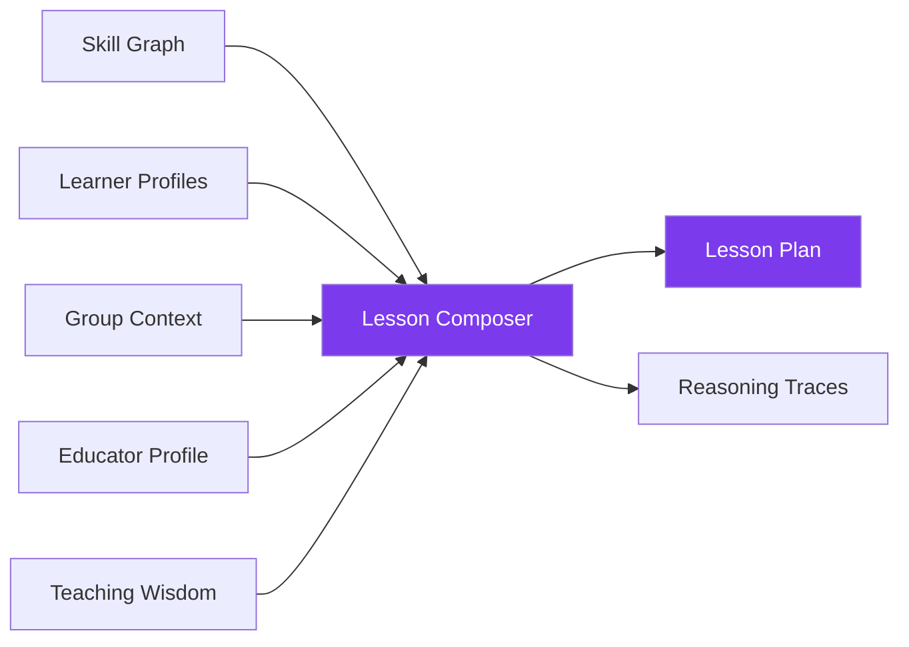

# Lifecycle: From "I want to teach" to accumulated wisdom

Everything happens through conversation with the engine. Here's the typical flow.

## The happy path

```mermaid
graph TD
    subgraph "1. Setup"
        A[Educator opens /teach] --> B[Describes their subject]
        B --> C[Engine interviews:<br/>skills, levels, dependencies]
        C --> D["create_domain<br/>writes skills.json + dependencies.json + manifest.json"]
    end

    subgraph "2. Know your students"
        D --> E[Educator describes their class]
        E --> F["Engine creates Group<br/>(setting, constraints, affective context)"]
        F --> G["generate_assessment_link<br/>creates shareable code"]
        G --> H["Students open /assess/{code}<br/>and chat with the assessment agent"]
        H --> I["assess_learner<br/>writes Learner profiles<br/>with skill levels + Bloom's + confidence"]
    end

    subgraph "3. Plan the lesson"
        I --> J["Engine loads: domain skills,<br/>group context, learner profiles,<br/>educator profile, teaching wisdom"]
        J --> K["analyze_tensions<br/>checks for pedagogical problems"]
        K --> L["compose_lesson_plan<br/>writes timed, stage-directed plan"]
        L --> M["store_reasoning_traces<br/>records why every decision was made"]
    end

    subgraph "4. Teach and reflect"
        M --> N[Educator teaches the lesson]
        N --> O["Educator debriefs via /teach<br/>(what worked, what didn't, surprises)"]
        O --> P["process_debrief<br/>extracts patterns, updates wisdom"]
    end

    style A fill:#4f46e5,color:#fff
    style D fill:#4f46e5,color:#fff
    style G fill:#dc2626,color:#fff
    style I fill:#059669,color:#fff
    style L fill:#7c3aed,color:#fff
    style P fill:#d97706,color:#fff
```

## What happens at each stage

### 1. Domain creation

The educator describes what they teach. The engine interviews them about skills, levels, and how skills build on each other, then proposes a skill graph. After iteration, `create_domain` writes:

- `skills.json` — every skill with its Bloom's level
- `dependencies.json` — directed edges (prerequisite relationships)
- `manifest.json` — audience, tags, setting, description

### 2. Group + Assessment

The educator describes their students. The engine creates a group file with setting, constraints, and affective context (anxiety levels, social dynamics, motivation). Then it generates an assessment link.

Each student chats with the assessment agent at `/assess/{code}`. The agent:
- Reads the domain manifest (knows the audience without asking)
- Reads any lesson/educator context threaded through the link
- Asks conversational skill-check questions
- Uses dependency inference to skip obvious prerequisites
- Writes a learner profile with assessed skills, inferred skills, and Bloom's levels demonstrated

### 3. Lesson composition

Before composing, the engine loads everything:

The composer also runs `analyze_tensions` first to catch problems: dependency violations, scope-time mismatches, prerequisite gaps. If it finds issues, it pushes back with evidence before proceeding.

The output is a timed, stage-directed lesson plan with:
- Per-learner differentiation tracks
- Accessibility accommodations
- Contingency plans
- Reasoning traces for every major decision

### 4. Teaching + Debrief

After the lesson, the educator debriefs through conversation. `process_debrief` extracts:
- Timing data (which sections ran over/under)
- Engagement observations (who was engaged, who disengaged)
- Surprises and confusion points
- What worked well

These feed into teaching notes (domain-level wisdom) and educator profile updates (timing pattern calibration).

## The conversation is the interface

There are no forms, no wizards, no step-by-step workflows. The educator just talks:

> "I'm a guest speaker giving a 50-minute talk on magical realism to Mr. Sanchez's AP Spanish Lit class next week."

From this single sentence, the engine:
1. Identifies the domain (spanish-literature) or creates it
2. Identifies the group (mr-sanchez-ap-spanish-lit) or creates it
3. Knows the time constraint (50 minutes)
4. Knows the setting (guest speaker, not regular instructor)
5. Can generate assessments with that context threaded through

The engine interviews to fill gaps, not to follow a checklist.

## Entry points

| URL | Who uses it | What happens |
|-----|------------|--------------|
| `/teach` | Educator | Full conversation: domain setup, group setup, assessments, lesson planning, debriefs |
| `/assess/{code}` | Student | Conversational skill check with the assessment agent |
| `/teach/live/{lesson-id}` | Educator (during class) | Real-time teaching companion on mobile |
| `/dashboard` | Educator | Visual skill analytics: dependency graph, group heatmap |
| `/wisdom` | Educator | Accumulated teaching insights per domain |
| `/profile` | Educator | Teaching style visualization and comparison |
